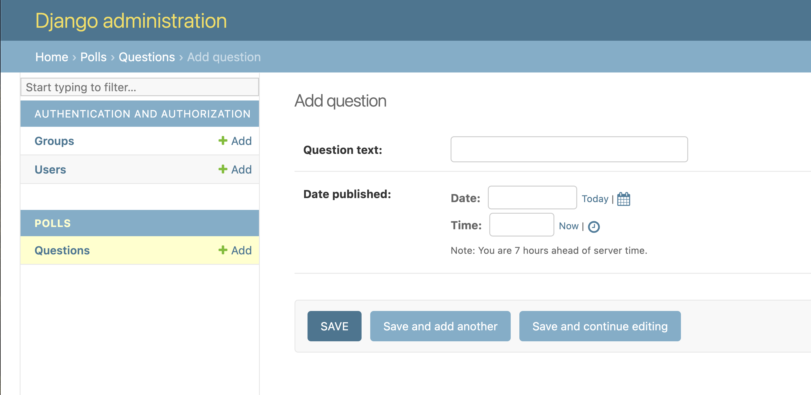
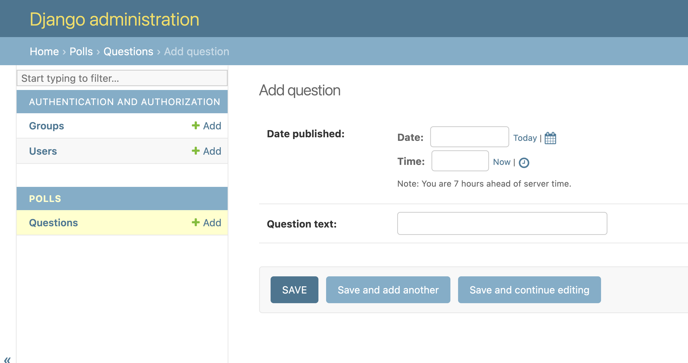
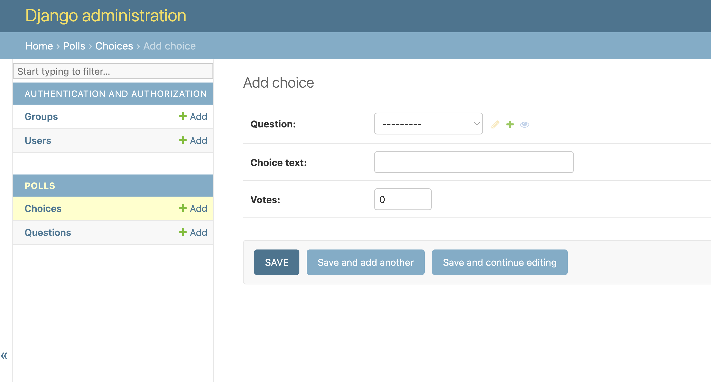
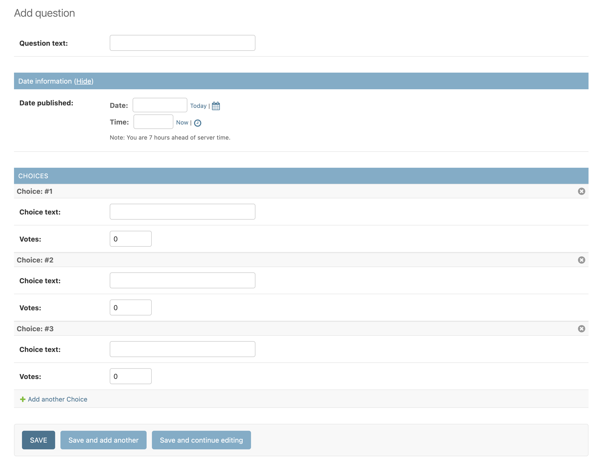
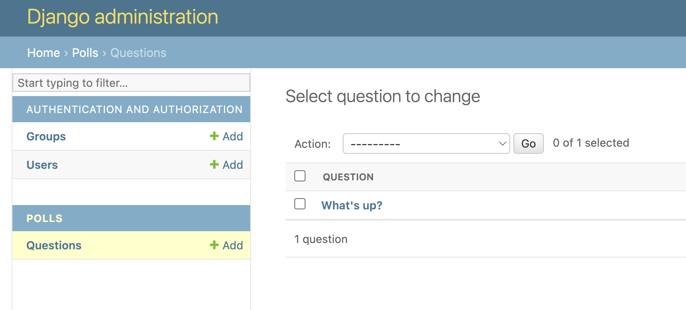
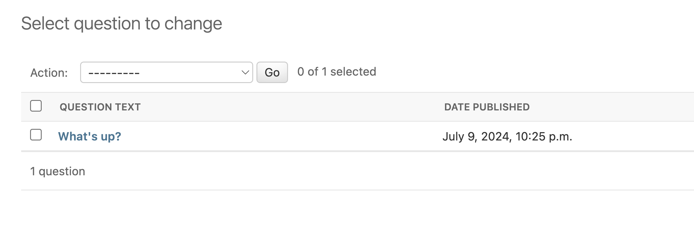
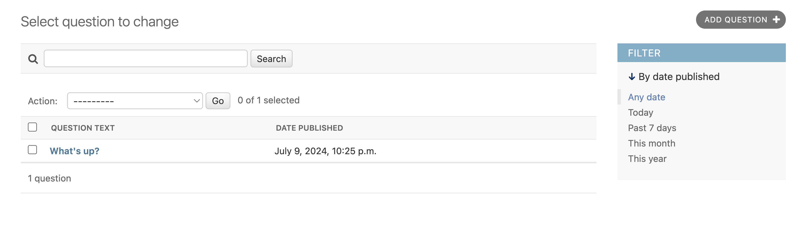

# Week 6 - Introducing the Django Admin

[Django tutorial part 2](https://docs.djangoproject.com/en/5.0/intro/tutorial02/)

โดยปกติ website ที่มีการบันทึกข้อมูลลงฐานข้อมูลมักจะมีส่วนที่เป็นระบบหลังบ้านสำหรับให้ `admin` ของ website ใช้ในการแก้ไขข้อมูลในฐานข้อมูล หรือ แก้ไขการตั้งค่าระบบต่างๆ

สำหรับ Django นั้นมี tool ที่ช่วยให้การสร้างหน้า admin site นั้นมีความง่ายและรวดเร็วมากๆ โดยแทบจะไม่ต้องเขียน code เลย

เรามาเริ่มต้นโดยการสร้าง project `week6_tutorial` กันก่อนตามขั้นตอนที่คุ้นเคย

1. สร้าง project ใหม่ชื่อ `week6_tutorial` (สร้าง virtual environment ใหม่ด้วย)
2. สร้าง app ชื่อ `polls` และทำการตั้งค่าใน `settings.py`
3. แก้ไขไฟล์ `/polls/models.py` และเพิ่ม code ด้่านล่างลงไป โดย models เหล่านี้เราจะใช้ในการทำ tutorial วันนี้กัน

```python
from django.db import models


class Question(models.Model):
    question_text = models.CharField(max_length=200)
    pub_date = models.DateTimeField("date published")


class Choice(models.Model):
    question = models.ForeignKey(Question, on_delete=models.CASCADE)
    choice_text = models.CharField(max_length=200)
    votes = models.IntegerField(default=0)
```

### Creating an admin user

ก่อนอื่นเรามาสร้าง admin user กันก่อน

```sh
>>> python manage.py createsuperuser
Username: admin
Email address: admin@example.com
Password: **********
Password (again): *********
Superuser created successfully.
```

### Enter the admin site

จากนั้นทำการ start server ขึ้นมา

```sh
python manage.py runserver
```

และเข้าไปที่ URL: http://127.0.0.1:8000/admin/


เมื่อทำการ login ด้วย username และ password ที่ตั้งแล้วจะได้หน้าจอดังภาพ


### Make the poll app modifiable in the admin

เบื้องต้นจะยังไม่มี model `Question` และ `Choice` ให้เราเข้าไปแก้ไขข้อมูล เราจะเพิ่มเข้ามาก่อน

เรามาเพิ่ม `Question` กันก่อนโดยเพิ่ม code นี้ในไฟล์ `polls/admin.py`

```python
from django.contrib import admin

from .models import Question

admin.site.register(Question)
```

จากนั้นเข้าไปที่ admin site ใหม่จะพบว่ามี model `Question` มาให้เราแก้ไขแล้ว


ลองกด `ADD QUESTION +` เพื่อเพิ่ม Question ใหม่เข้าสู่ database จะเห็นว่ามีฟอร์มมาให้กรอก `Question text` และ `Date published` ซึ่งจะเห็นได้ว่าในช่องสำหรับกำหนด `Date published` นั้นเป็น date picker และ time picker ซึ่ง Django นั้นดูจากที่เรากำหนดใน model `Question` ให้ field `pub_date` เป็น `DateTimeField`



## Customize the admin form

[Django tutorial part 7](https://docs.djangoproject.com/en/5.0/intro/tutorial07/)

เรามาลองแก้ไขฟอร์มสร้าง `Question` ในไฟล์ `polls/admin.py`

```python
from django.contrib import admin

from .models import Question


class QuestionAdmin(admin.ModelAdmin):
    fields = ["pub_date", "question_text"]


admin.site.register(Question, QuestionAdmin)
```

จะเห็นได้ว่า field `Date published` สลับมาอยู่ก่อน `Question text` ซึ่งเกิดจากที่เรากำหนดค่า fields ใน class `QuestionAdmin(admin.ModelAdmin)`



### Adding related objects

ทีนี้เรามาลองเพิ่ม `Choice` กันบ้างในไฟล์ `polls/admin.py`

```python
from django.contrib import admin

from .models import Choice, Question

# ...
admin.site.register(Choice)
```

จะมีหน้า Add Choice ขึ้นมาดังรูป



จะเห็นได้ว่่าเมื่อเรากดเพิ่ม `Choice` ในหน้า Add Choice จะมี drop down select ให้เลือก `Question` ขึ้นมาเลย เนื่องจาก Django รู้จากที่เรากำหนดไปว่า `Choice` นั้นมี FK ชี้ไปหา `Question`

อย่างไรก็ตามการเพิ่ม Choice แบบนี้ผมว่ามันใช้งานยาก เรามาทำให้ทั้งการเพิ่ม Choice และ Question อยู่ในหน้าเดียวกันเลยดีกว่า

ปรับเปลี่ยน code ใน `polls/admin.py` เป็นดังนี้

```python
from django.contrib import admin

from .models import Choice, Question


class ChoiceInline(admin.StackedInline):
    model = Choice
    extra = 3


class QuestionAdmin(admin.ModelAdmin):
    fieldsets = [
        (None, {"fields": ["question_text"]}),
        ("Date information", {"fields": ["pub_date"], "classes": ["collapse"]}),
    ]
    inlines = [ChoiceInline]


admin.site.register(Question, QuestionAdmin)
```

หน้า Add Question จะมีรายการ Choice ขึ้นมาให้เพิ่ม 3 รายการโดย default (สามารถกดลบ / เพิ่มได้)



ในส่วน section **CHOICES** ค่อนข้างเปลืองพื้นที่เพราะว่า `Choice text` และ `Votes` อยู่คนละบรรทัดกัน ตรงส่วนนี้ทำให้เป็นรูปแบบตารางน่าจะสวยกว่า ปรับแก้ไข code ใน `polls/admin.py` แก้ไขจากที่ `ChoiceInline` extend `admin.StackedInline` เป็น `admin.TabularInline` แล้วลองดูสิว่าเป็นอย่างไร

```python
class ChoiceInline(admin.TabularInline):
    ...
```

### Customize the admin change list

เรามาลองปรับแก้ไขหน้าตาของหน้า **Change list** กันบ้าง ตอนนี้มีหน้าตาแบบนี้



โดย default Django จะแสดงชื่อของ object โดยดูจาก `__str__()` ซึ่งตอนนี้จะเป็น `question_text` สมมติเราอยากให้แสดงทั้ง `question_text` และ `pub_date` สามารถตั้งค่า list_display ดัง code ด้านล่าง

```python
class QuestionAdmin(admin.ModelAdmin):
    ...
    list_display = ["question_text", "pub_date"]
```



ลองนึกภาพถ้าเรามีข้อมูลเยอะๆ เป็นร้อยหรือพันรายการ หน้า **Change list** นี้น่าจะหา Question ที่เราต้องการแก้ไขได้ยากมาก ดังนั้นเราสามารถเพิ่ม filter และ search box ได้ในหน้านี้โดย

```python
class QuestionAdmin(admin.ModelAdmin):
    ...
    list_filter = ["pub_date"]
    search_fields = ["question_text"]
```

จะได้ผลลัพธ์ดังภาพ



ซึ่งจริงๆ แล้ว **Django Admin Site** นั้นสามารถ config ได้ยืดหยุ่น มีความสามารถหลากหลาย และ สามารถ custom ได้ค่อนข้างเยอะ ถ้าใครสนใจเพิ่มเติมสามารถไปอ่าน document เพิ่มเติมได้ที่ [The Django admin site](https://docs.djangoproject.com/en/5.0/ref/contrib/admin/#module-django.contrib.admin)
